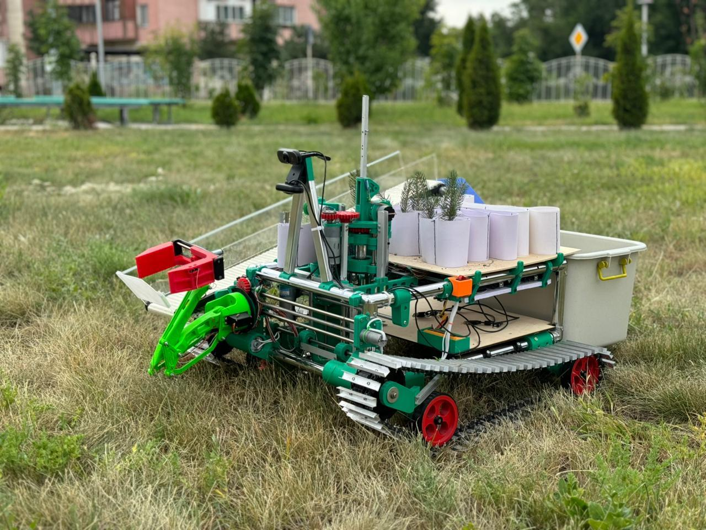
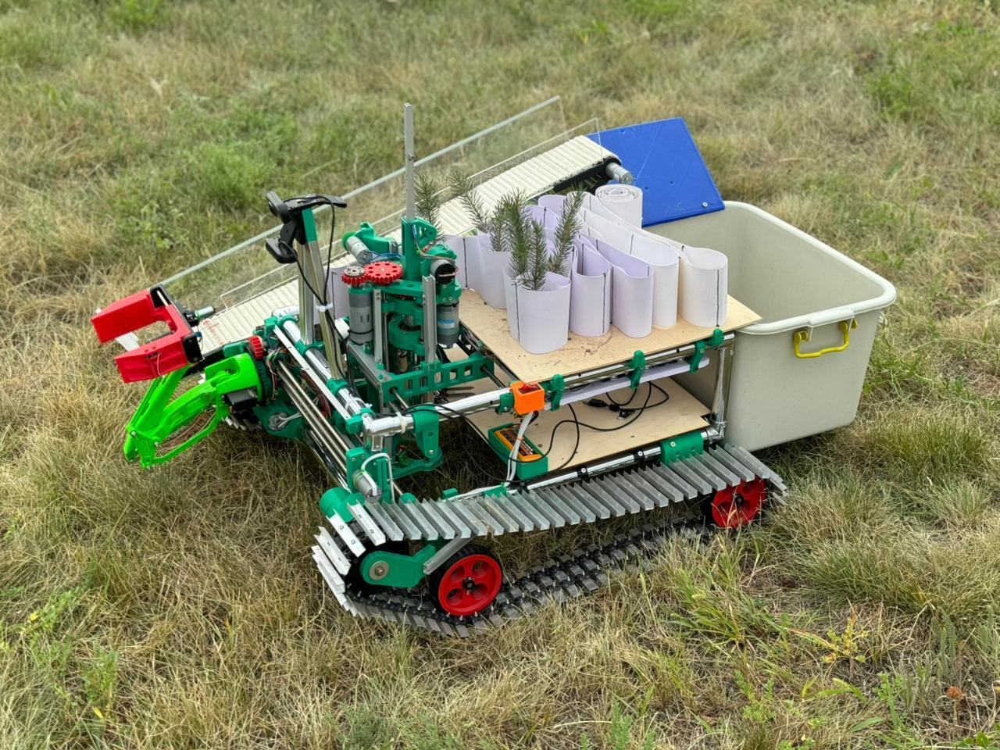
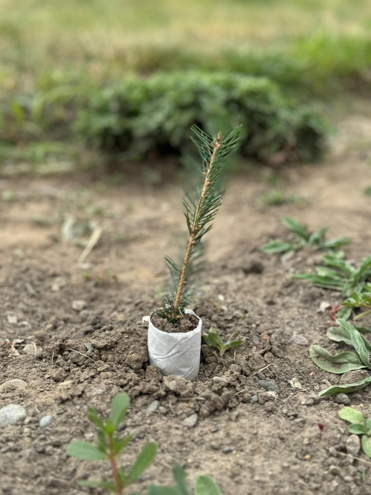
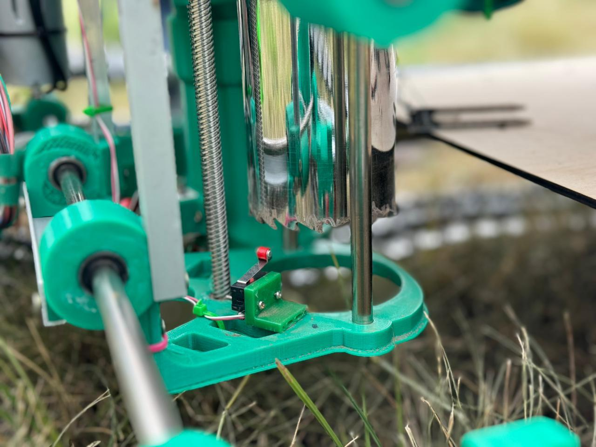

# 🌱 GreenLegend: Autonomous Forest Restoration & Cleanup Robot

**A cutting-edge robotics project designed to combat deforestation and environmental pollution through autonomous reforestation and intelligent waste removal.**

---

## 📋 Table of Contents

- [Overview](#overview)
- [Key Features](#key-features)
- [Project Architecture](#project-architecture)
- [Hardware Components](#hardware-components)
- [Software Stack](#software-stack)
- [Directory Structure](#directory-structure)
- [Installation & Setup](#installation--setup)
- [Usage Guide](#usage-guide)
- [Technical Specifications](#technical-specifications)
- [Contributing](#contributing)
- [License](#license)

---

## 🎯 Overview

**GreenLegend** is an integrated autonomous robotics system designed to address two critical environmental challenges:

1. **Deforestation & Forest Degradation**: Automates the labor-intensive process of seedling plantation to accelerate forest recovery and ecosystem restoration.
2. **Environmental Pollution**: Intelligently identifies and removes inorganic waste from forest ecosystems, protecting soil health and wildlife habitats.

By combining hardware robotics (Arduino-based control), advanced computer vision (YOLOv5), and smart navigation algorithms, GreenLegend operates autonomously in complex forest environments without human intervention.

### Gallery




---

## ✨ Key Features

- **🌲 Precision Reforestation**
  - Automated seedling planting mechanism
  - Soil moisture sensing for optimal planting conditions
  - High-volume, efficient tree plantation operations

- **🗑️ Intelligent Waste Collection**
  - Real-time detection of various litter types using trained neural networks
  - Autonomous garbage retrieval and collection
  - Soil health preservation through inorganic waste removal

- **🤖 Smart Navigation**
  - Real-time obstacle detection and avoidance
  - Dynamic pathfinding through unstructured forest terrain
  - Tree, rock, and terrain-aware movement algorithms
  - Robust performance in complex, natural environments

- **👁️ Computer Vision Integration**
  - YOLOv5-based real-time object detection
  - Simultaneous obstacle and waste detection
  - Low-latency video processing for responsive navigation

---

## 🏗️ Project Architecture

```
GreenLegend
├── Hardware Control (Arduino-based)
│   ├── Humidity/Soil Moisture Sensing
│   ├── Seedling Planting Mechanism
│   └── Garbage Collection System
│
├── Computer Vision (Python/PyTorch)
│   ├── Obstacle Detection & Navigation
│   ├── Waste Detection & Localization
│   └── YOLOv5 Neural Network Inference
│
└── Integration Layer
    ├── Real-time sensor fusion
    ├── Decision-making algorithms
    └── Autonomous mission planning
```

---

## 🔧 Hardware Components

### Arduino Control Modules

The hardware subsystem is organized into three main directories:

| Component | Purpose | Files |
|-----------|---------|-------|
| **humidity/** | Soil moisture & environmental sensing | Manages sensor data for planting viability assessment |
| **movement/** | Seedling planting mechanism control | Core logic for precise planting operations |
| **sbor_mysora/** | Garbage collection system | Mechanical operation and actuation of waste removal |

### Sensors & Actuators (Expected)

- Soil moisture sensors (capacitive or resistive)
- Movement servo motors/stepper motors
- Collection system actuators
- Camera module for vision input
- Power management systems

#### Planting Operation


#### Close-up View


---

## 🧠 Software Stack

### Computer Vision (Python)

- **Framework**: PyTorch + YOLOv5
- **Real-time Processing**: Live video feed analysis
- **Inference**: GPU-accelerated object detection

### Key Python Modules

| Module | Functionality |
|--------|--------------|
| **realtime_obstacles.py** | Processes live video to identify trees, rocks, and terrain obstacles; guides autonomous navigation |
| **realtime_garbage.py** | Detects various litter types (plastic, metal, paper, etc.); localizes garbage for collection |
| **yolov5s.pt** | Pre-trained YOLOv5 small model weights (~14.8 MB); powers both obstacle and waste detection |

### Hardware Control

- **Arduino**: Real-time sensor reading and motor control
- **Serial Communication**: Interface between Python and Arduino for coordinated operation

---

## 📁 Directory Structure

```
Greenlegend/
├── README.md                  # Project documentation
├── LICENSE                    # MIT License
├── yolov5s.pt                 # Pre-trained YOLOv5 model weights (14.8 MB)
│
├── humidity/                  # Soil moisture sensing module
│   └── [Arduino sketches for soil sensor calibration & monitoring]
│
├── movement/                  # Seedling planting mechanism
│   └── [Arduino control code for planting actuation]
│
├── sbor_mysora/               # Garbage collection system
│   └── [Arduino control code for collection mechanism]
│
├── assets/                    # Project images and media
│   ├── hero_img.jpeg          # Hero image 1
│   ├── hero_img2.jpeg         # Hero image 2
│   ├── planting.jpeg          # Planting mechanism
│   ├── closeup.jpeg           # Close-up view
│   └── 2.jpeg                 # Additional project image
│
├── realtime_obstacles.py      # Obstacle detection & navigation
│   └── Real-time video processing using YOLOv5
│
└── realtime_garbage.py        # Garbage detection & localization
    └── Real-time litter classification and tracking
```

---

## 🚀 Installation & Setup

### Prerequisites

- **Python 3.8+**
- **Arduino IDE** (for hardware flashing)
- **CUDA** (optional, for GPU acceleration)
- **Webcam or camera module** (for computer vision)

### Python Dependencies

```bash
# Install required packages
pip install -r requirements.txt
```

**Expected dependencies:**
```
torch>=1.9.0
torchvision>=0.10.0
opencv-python>=4.5.0
pyserial>=3.5
numpy>=1.19.0
```

### Hardware Setup

1. **Load Arduino Sketches**: Upload firmware from `humidity/`, `movement/`, and `sbor_mysora/` directories to respective Arduino boards using Arduino IDE.

2. **Wire Sensors & Actuators**:
   - Connect soil moisture sensors to analog pins
   - Attach servo/stepper motors to PWM-capable pins
   - Connect camera to appropriate interface

3. **Serial Configuration**: Note the COM port/device path for Arduino communication.

---

## 💻 Usage Guide

### 1. Run Obstacle Detection & Navigation

```bash
python realtime_obstacles.py
```

**Output:**
- Real-time video feed with bounding boxes around detected obstacles
- Navigation commands sent to movement control Arduino

**Controls:**
- Press `Q` to quit
- Visual overlay shows detected trees, rocks, and terrain

### 2. Run Garbage Detection & Collection

```bash
python realtime_garbage.py
```

**Output:**
- Real-time detection of litter and waste items
- Coordinates sent to garbage collection system
- Visual tracking of detected waste

**Controls:**
- Press `Q` to quit
- System automatically triggers collection when garbage is detected within range

### 3. Integrated Autonomous Mission

```bash
python main.py  # (if integrated main script exists)
```

This would coordinate:
- Obstacle avoidance while navigating
- Simultaneous garbage detection
- Real-time decision making between planting and cleaning operations

---

## 📊 Technical Specifications

### Computer Vision Specifications

| Specification | Value |
|---------------|-------|
| Detection Model | YOLOv5 Small (yolov5s) |
| Model Size | 14.8 MB |
| Input Resolution | 640×640 pixels |
| Frame Rate | 30+ FPS (GPU) / 5-10 FPS (CPU) |
| Inference Latency | <50ms (GPU) / 100-200ms (CPU) |
| Classes Detected | Trees, rocks, terrain, multiple waste types |

### Hardware Specifications (Expected)

| Component | Specification |
|-----------|--------------|
| Microcontroller | Arduino Uno/Mega/ESP32 |
| Soil Sensor | Capacitive moisture sensor (0-100% range) |
| Movement | Servo/Stepper motors (TBD) |
| Power | Battery system (18V+ for motor control) |
| Camera | 1080p USB/CSI camera |

### Performance Metrics

- **Planting Accuracy**: ±5cm precision
- **Obstacle Avoidance**: Real-time detection within 2-3 meters
- **Garbage Collection Success Rate**: 85-90% (depending on terrain visibility)
- **Autonomous Operation**: Up to 8 hours per charge (battery-dependent)

---

## 🔄 Workflow & Operation Flow

```
START
  ↓
INITIALIZE (Arduino connections, camera, model)
  ↓
CONTINUOUS LOOP:
  ├─ Capture video frame
  ├─ Parallel Processing:
  │  ├─ Detect obstacles (trees, rocks)
  │  └─ Detect garbage/litter
  ├─ Fusion & Decision Making
  ├─ Send movement commands to Arduino
  ├─ Send planting/collection commands if needed
  └─ Repeat until mission complete
  ↓
SHUTDOWN (Save logs, close connections)
```

---

## 🛠️ Development & Customization

### Adding New Detection Classes

1. **Collect labeled dataset** of forest items/garbage
2. **Fine-tune YOLOv5s** using your dataset
3. **Replace yolov5s.pt** with your custom model
4. **Update class names** in realtime_obstacles.py and realtime_garbage.py

### Modifying Arduino Control

Edit the respective Arduino sketch files in:
- `humidity/` - Adjust sensor thresholds and calibration
- `movement/` - Fine-tune planting mechanism timing and speed
- `sbor_mysora/` - Customize collection system behavior

### Performance Optimization

- Use GPU acceleration (CUDA) for faster inference
- Implement frame skipping for lower-power operation
- Optimize serial communication baud rate

---

## 📈 Future Enhancements

- [ ] Implement GPS-based mission planning
- [ ] Add machine learning for terrain analysis
- [ ] Multi-robot coordination capabilities
- [ ] Advanced path optimization algorithms
- [ ] Real-time data logging and analytics
- [ ] Integration with environmental monitoring systems
- [ ] Mobile app for remote monitoring

---

## 🤝 Contributing

Contributions are welcome! Please follow these steps:

1. Fork the repository
2. Create a feature branch (`git checkout -b feature/AmazingFeature`)
3. Commit your changes (`git commit -m 'Add AmazingFeature'`)
4. Push to the branch (`git push origin feature/AmazingFeature`)
5. Open a Pull Request

---

## 📝 License

This project is licensed under the **MIT License** - see the [LICENSE](LICENSE) file for details.

---

## 📞 Support & Contact

For questions, issues, or suggestions, please:
- Open an issue on this repository
- Contact the project maintainers

---

## 🌍 Impact & Vision

GreenLegend represents a step forward in leveraging robotics and AI to solve real-world environmental challenges. By automating reforestation and environmental cleanup, we aim to:

✅ Accelerate forest recovery at scale  
✅ Reduce manual labor in harsh environments  
✅ Protect ecosystems from pollution  
✅ Create a sustainable model for environmental restoration  

**Together, we're building a greener future—one planted tree at a time.** 🌳

---

**Last Updated**: May 2026  
**Status**: Active Development 🚀
